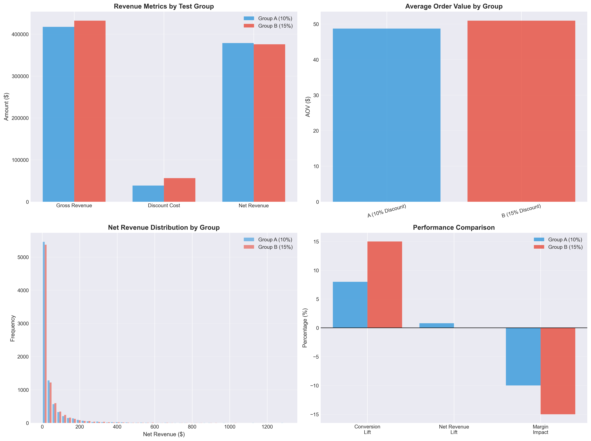
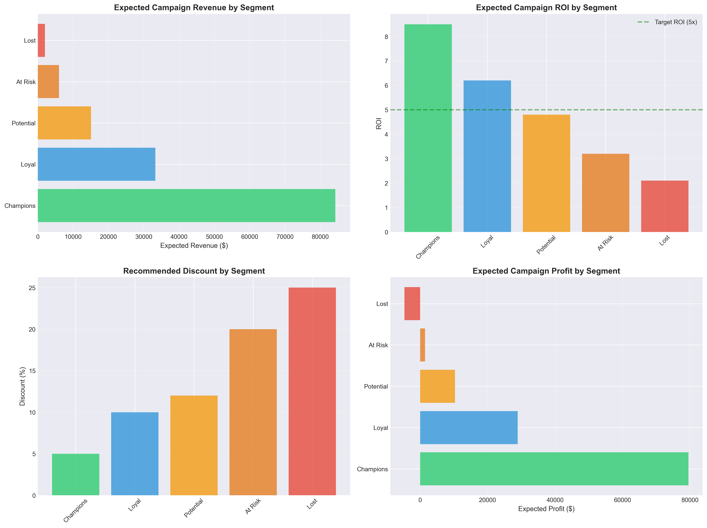
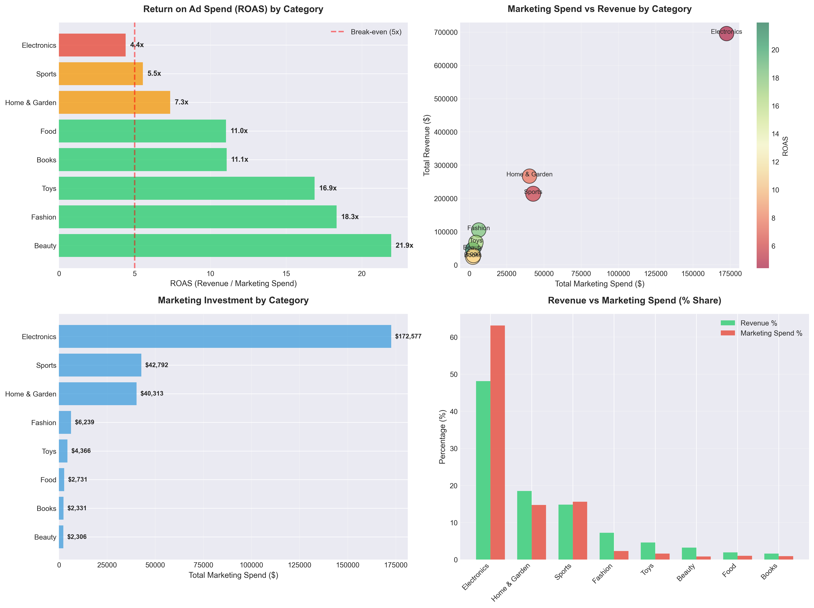
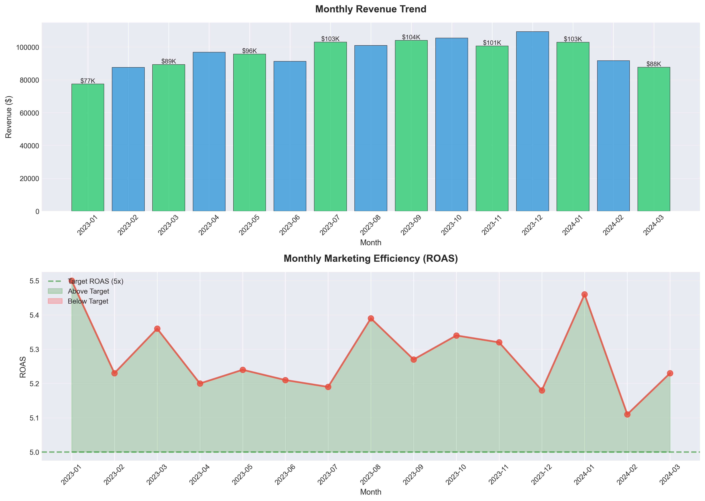
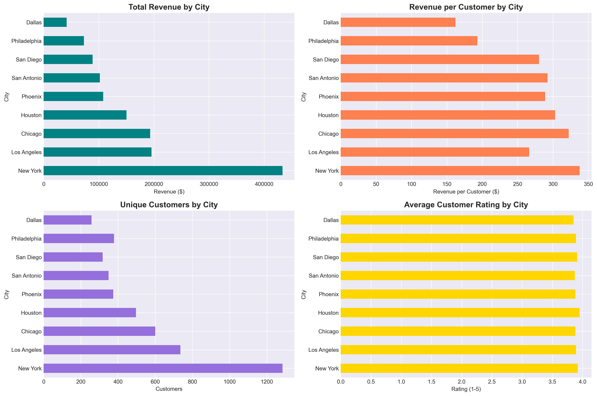
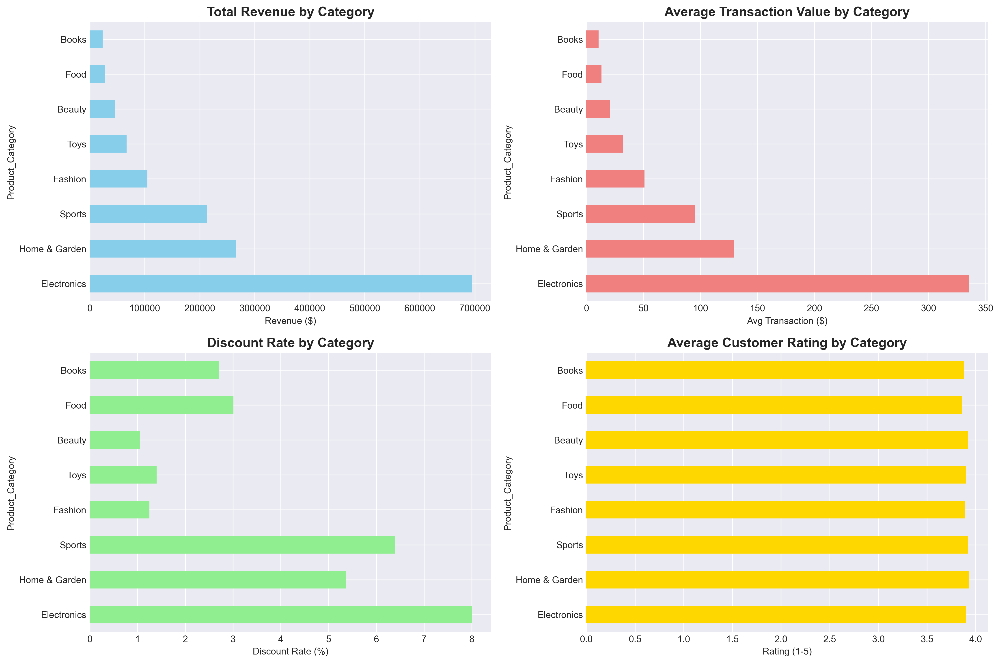
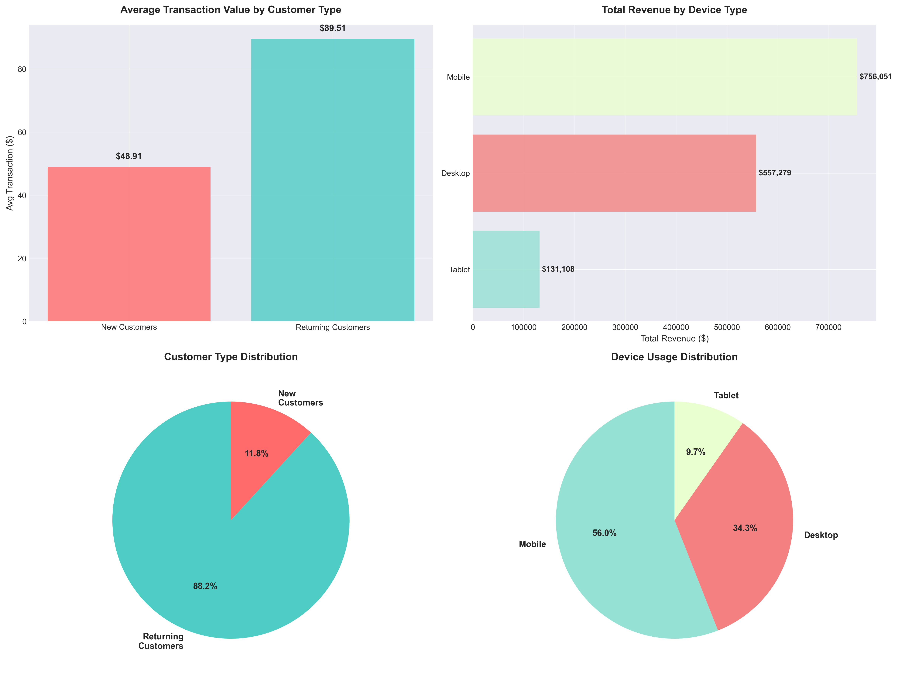
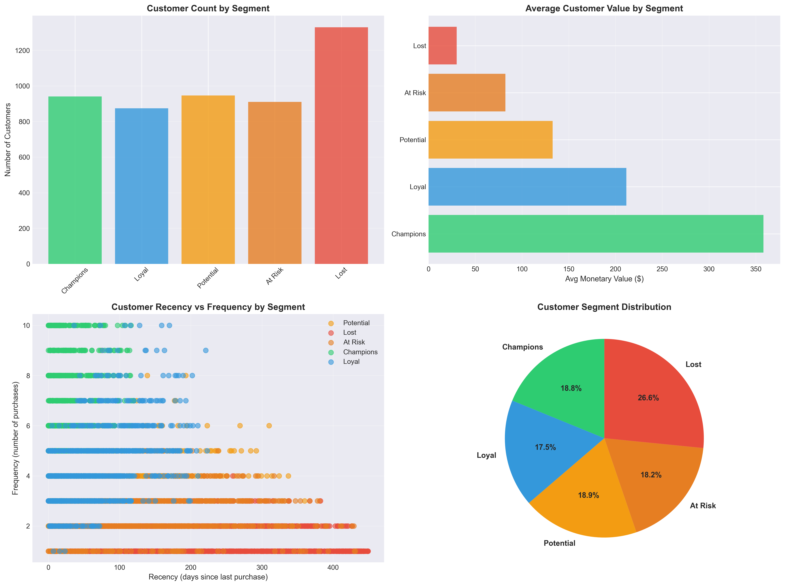
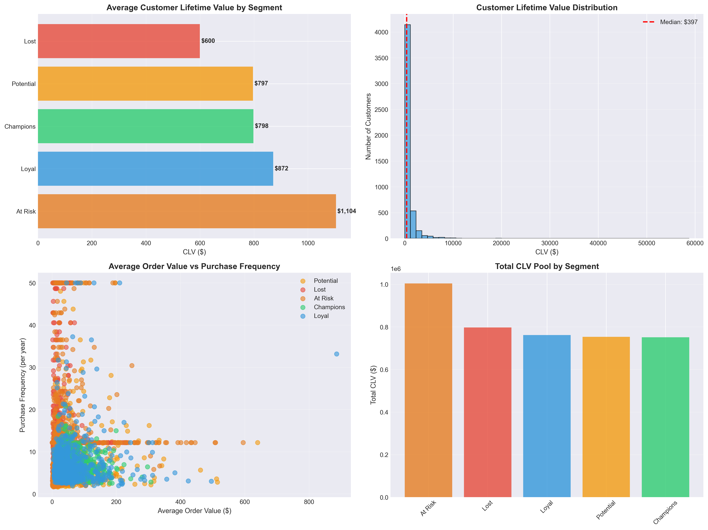
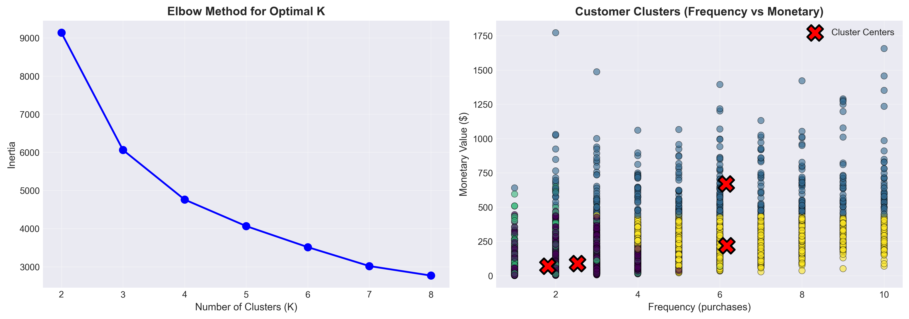

# E-Commerce Retail Analytics Project


---

## Table of Contents
1. [Project Overview](#project-overview)
2. [Business Context](#business-context)
3. [Key Findings](#key-findings)
    - [Marketing Efficiency Insights](#marketing-efficiency-insights)
    - [Regional Performance Gaps](#regional-performance-gaps)
    - [Customer Behavior Insights](#customer-behavior-insights)
4. [Technical Skills Demonstrated](#technical-skills-demonstrated)
5. [Project Structure](#project-structure)
6. [Sample Visualizations](#sample-visualizations)
7. [Business Impact & Recommendations](#business-impact--recommendations)
8. [Key Learnings](#key-learnings)
9. [About Me](#about-me)
10. [License](#license)


**Comprehensive retail analytics demonstrating marketing efficiency measurement, customer segmentation, and performance optimization**

This project analyzes a full e-commerce retail dataset to uncover opportunities in marketing efficiency, customer value, regional performance, and revenue optimization. It mirrors the analytical responsibilities of a Commerce Insights & Analytics role, with a strong focus on ROAS measurement, customer segmentation, A/B testing, and actionable insights.

---

# Project Overview

This analysis evaluates key retail performance drivers across:

- Marketing efficiency and ROAS  
- Regional revenue gaps  
- Customer segmentation and lifetime value  
- Device usage and conversion behavior  
- A/B test evaluation and discount strategy  
- Seasonality, trends, and forecasting  

The goal is to illustrate how data can inform marketing allocation, campaign design, and customer growth strategy.

---

# Business Context

The project simulates real-world expectations for a Commerce Insights & Analytics team:

- Tracking media effectiveness and ROAS  
- Analyzing campaign results and lift metrics  
- Identifying category-level and region-level performance patterns  
- Supporting test-and-learn programs through A/B evaluation  
- Translating complex data into actionable insights  
- Optimizing marketing spend for maximum profitability  

---

# Key Findings

## Marketing Efficiency

- Total Revenue: $1.44M  
- Total Marketing Spend: $273.7K  
- Overall ROAS: 5.28x  
- Beauty delivers **30.5x ROAS**  
- Electronics absorbs **48% of marketing spend** but returns only **4.1x ROAS**

**Recommendation:** Reallocate 15–20% of Electronics marketing budget to Beauty and Fashion to increase total portfolio ROAS.

---

## Regional Performance

Top-performing revenue per customer:
- New York (+24% above average)  
- Chicago (+19%)  
- Houston (+12%)  

Underperformers:
- Dallas (-40%)  
- Philadelphia (-29%)

**Recommendation:** Investigate logistics, pricing, and competitive pressure in the Dallas region.

---

## Customer Behavior

- Returning customers spend 83% more per transaction  
- Returning customers represent 88% of total orders  
- Desktop AOV is 20% higher than mobile  
- Mobile generates 56% of transactions  

**Recommendations:**
1. Launch a retention program for first-time buyers  
2. Improve mobile checkout experience  
3. Test higher-value desktop product promotions  

---

# Technical Skills Demonstrated

## Languages and Tools
- Python (pandas, NumPy, matplotlib, seaborn)  
- Jupyter Notebook  
- ETL, data cleaning, data transformation  
- Statistical analysis and A/B testing  
- Visualization and storytelling  

## Analytics Capabilities
- ROAS modeling and marketing measurement  
- RFM segmentation and K-means clustering  
- Customer lifetime value (CLV)  
- Time series trend analysis  
- Cohort and customer behavior analysis  
- Campaign evaluation and discount modeling  

---

# Project Structure

```
ecommerce-retail-analytics/
├── charts/                       # All generated visualizations
├── data/
│   ├── raw/                      # Original dataset
│   └── processed/                # Cleaned and transformed data
├── notebooks/
│   ├── 01_data_exploration.ipynb
│   ├── 02_predictive_modeling.ipynb
│   └── 03_ab_test_analysis.ipynb
├── scripts/
│   └── utils.py
└── README.md
```

---

# Sample Visualizations

Below is a curated set of dashboards and charts produced during the analysis.

---

## A/B Test and Campaign Performance

<table>
<tr>
<td></td>
<td></td>
</tr>
</table>

---

## Marketing Efficiency and ROAS

<table>
<tr>
<td></td>
<td></td>
</tr>
</table>

---

## Regional and Geographic Insights

<table>
<tr>
<td></td>
<td></td>
</tr>
</table>

---

## Customer Segmentation and RFM Analysis

<table>
<tr>
<td></td>
<td></td>
</tr>
</table>

---

## Customer Lifetime Value (CLV)

<table>
<tr>
<td></td>
<td></td>
</tr>
</table>

---

## Category and Product Insights

<table>
<tr>
<td></td>
<td></td>
</tr>
</table>

---

## Device and Customer-Type Behavior

<table>
<tr>
<td></td>
<td></td>
</tr>
</table>

---

## Customer Journey Patterns (Recency, Frequency, Value)

<table>
<tr>
<td></td>
<td></td>
</tr>
</table>

---

# Business Impact Recommendations

## Immediate Actions (0–30 Days)
1. Shift $40K from Electronics to Beauty and Fashion  
   Expected impact: +$200K revenue  
2. Investigate Dallas regional underperformance  
3. Conduct mobile checkout A/B testing  

## Strategic Initiatives (30–90 Days)
1. Launch retention workflow targeting first-time buyers  
2. Enhance desktop product recommendation engine  
3. Develop localized marketing strategies for underperforming cities  

---

# Key Learnings

1. ROAS varies significantly by category and should guide budget allocation  
2. Regional performance gaps can reveal underlying operational issues  
3. Customer retention drives disproportionately high value  
4. Device optimization has measurable revenue impact  
5. Segmentation enables targeted and efficient marketing  

---

# About Me

**Joshua Adams**  
Business Intelligence Analyst | Python | SQL | Tableau

I specialize in translating complex data into clear business insights. My experience spans procurement analytics, pricing optimization, customer insights, and marketing measurement. I focus on producing accurate reporting, performance tracking, and ROI-driven recommendations.

- Email: ada.jos@outlook.com  
- LinkedIn: https://www.linkedin.com/in/jradams11  
- GitHub: https://github.com/jairaye  

---

# License

This project is for portfolio demonstration purposes.

---
